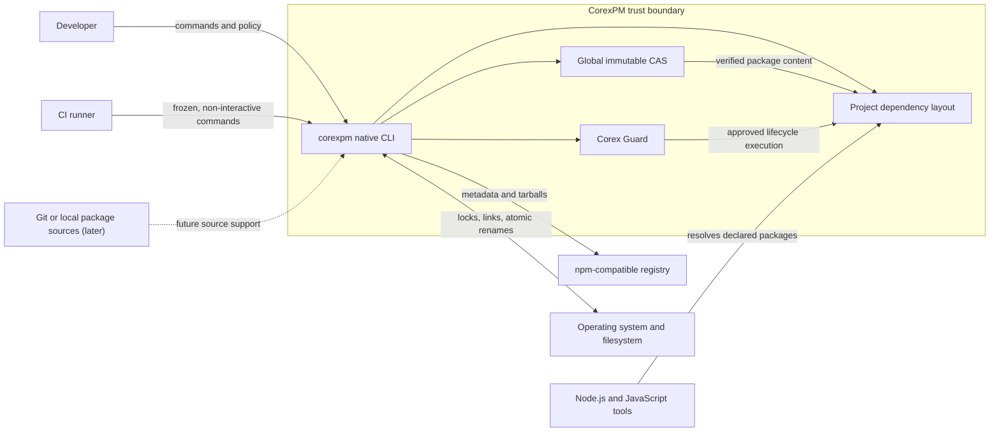

# System context

The registry supplies untrusted bytes. CorexPM verifies and applies policy
before those bytes can influence execution. Node.js consumes the project
layout, but CorexPM itself does not require Node.js to start.

