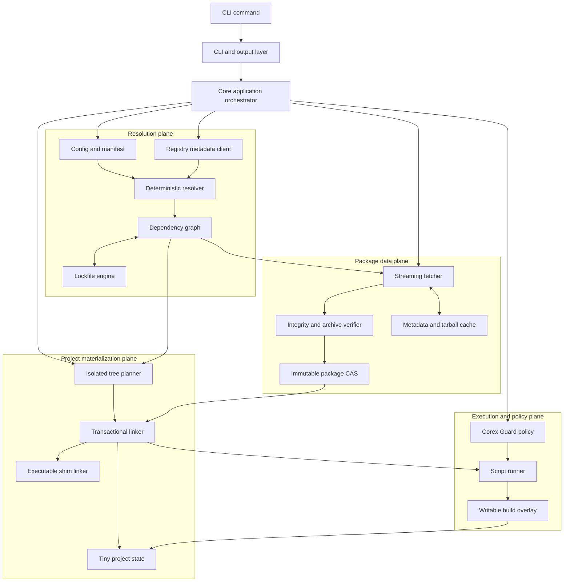

# Container architecture

Resolution describes exact package identities. The data plane obtains immutable
content. Materialization creates project references. Execution is a separate
policy-controlled stage and never mutates shared package source.

