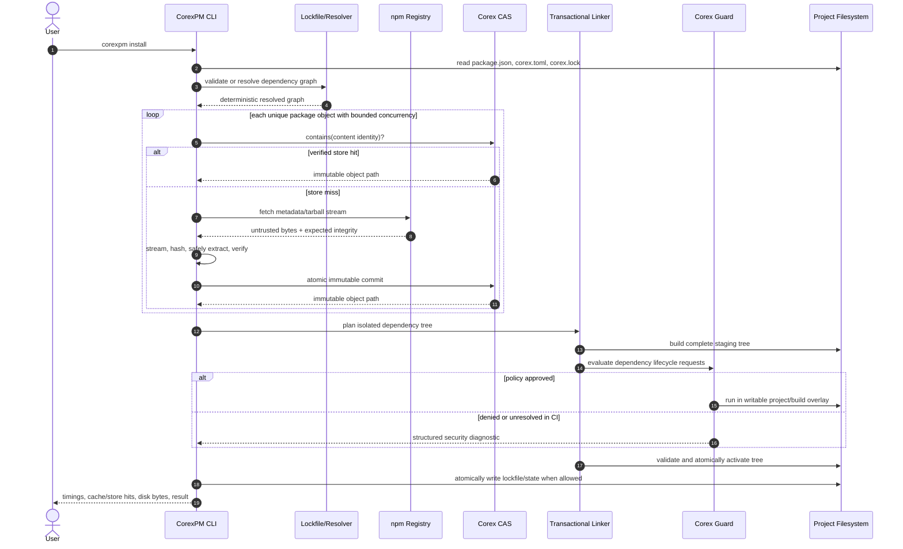

# Install sequence

Package fetches are concurrent, but graph ordering, lockfile bytes, and final
layout remain deterministic. Frozen mode stops before mutation if inputs do not
match the lockfile.

