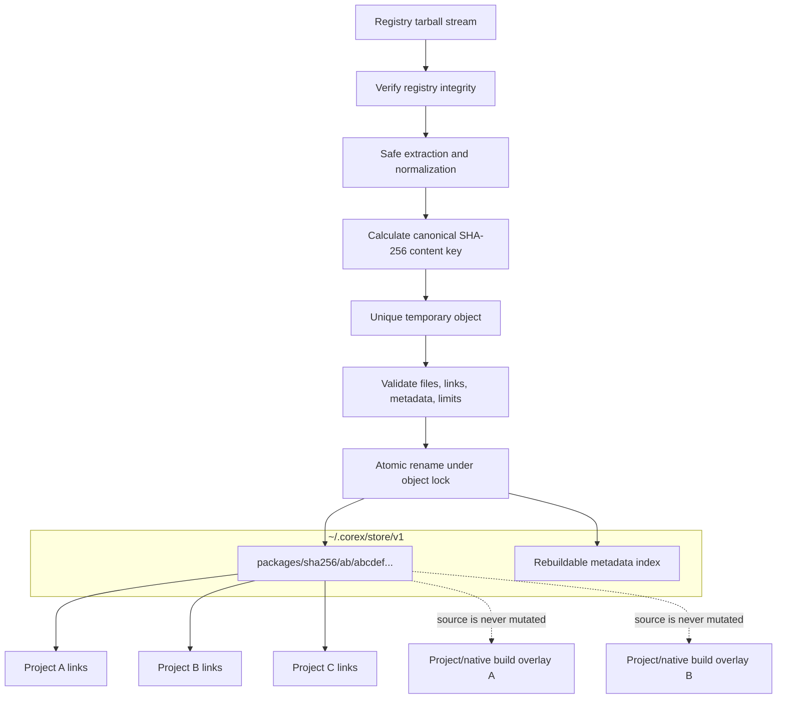
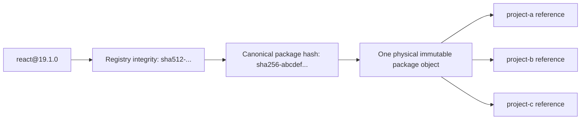

# Corex CAS storage

Registry integrity authenticates the downloaded artifact expected by metadata.
The canonical content key identifies CorexPM's normalized immutable object.
Keeping both avoids conflating transport verification with local identity.

