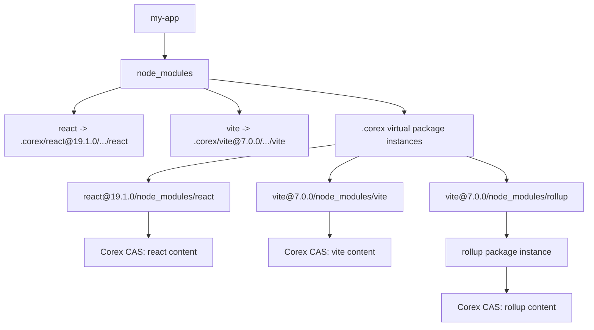
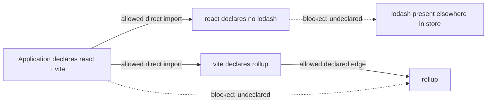

# Isolated `node_modules` layout

## Project view

## Dependency visibility

Only graph edges become resolution paths. A package existing globally does not
make it importable, preventing phantom dependencies while retaining ordinary
Node.js-visible paths for declared dependencies.

