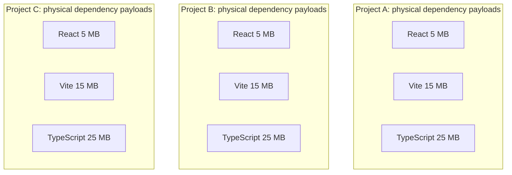
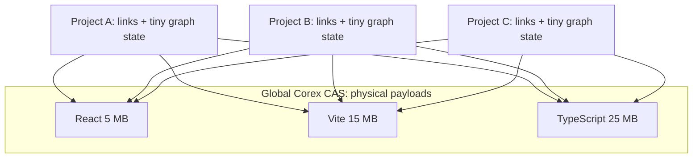
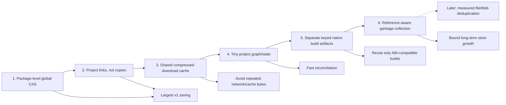

# Disk-reduction architecture

## Traditional repeated materialization

Illustrative physical package payload: `3 × 45 MB = 135 MB`.

## CorexPM shared package representation

Illustrative physical package payload: `45 MB + link/state overhead`. The
example explains the mechanism; CorexPM reports measured filesystem allocation
rather than promising a fixed percentage.

## Reduction layers

See the [size-reduction plan](../node-modules-size-reduction.md) for formulas,
measurement, implementation phases, and failure handling.

