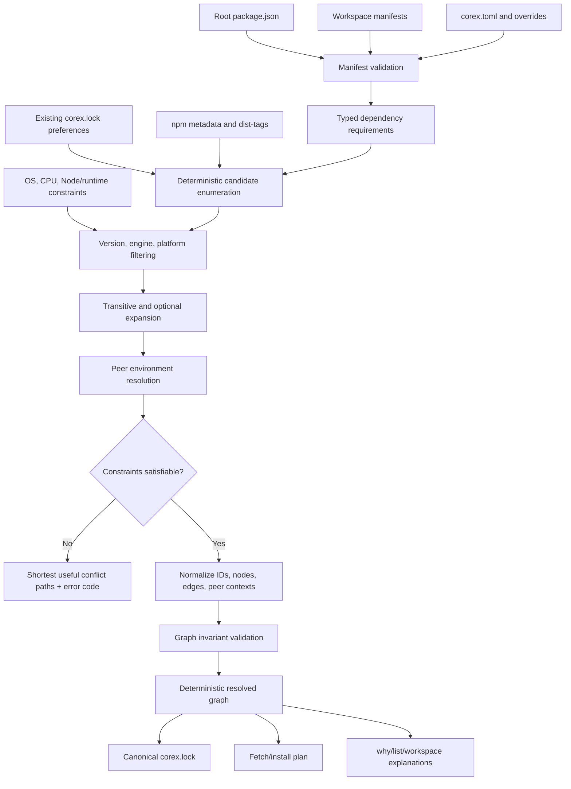
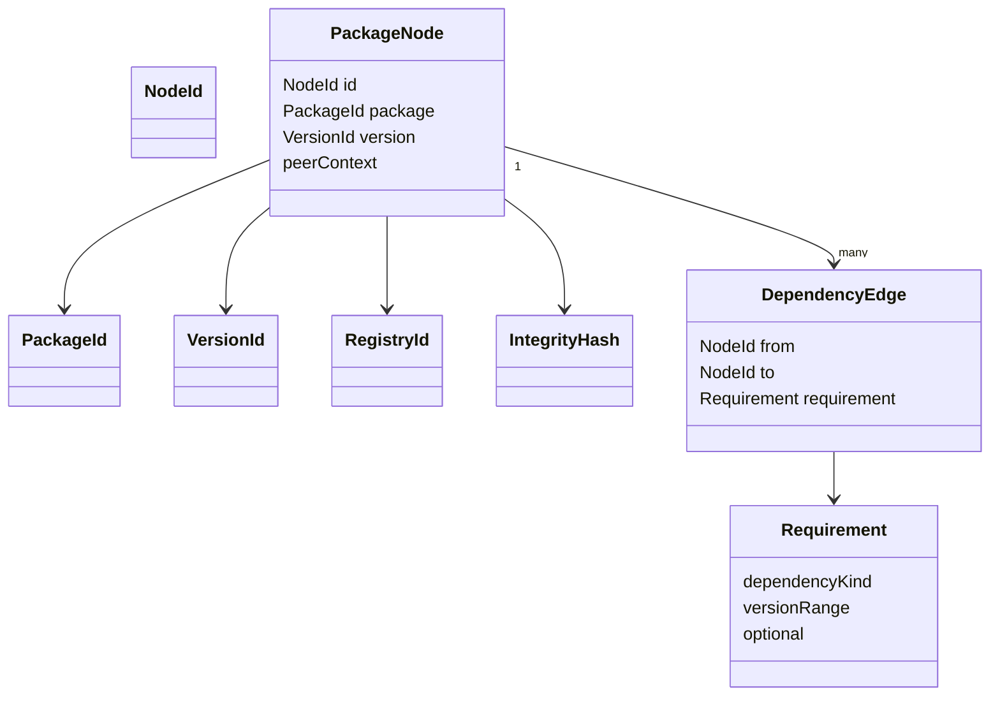

# Resolver architecture

```mermaid
flowchart TB
    Root["Root package.json"] --> Parse["Manifest validation"]
    Workspaces["Workspace manifests"] --> Parse
    Config["corex.toml and overrides"] --> Parse
    Lock["Existing corex.lock preferences"] --> Candidates
    Registry["npm metadata and dist-tags"] --> Candidates
    Platform["OS, CPU, Node/runtime constraints"] --> Filter

    Parse --> Requirements["Typed dependency requirements"]
    Requirements --> Candidates["Deterministic candidate enumeration"]
    Candidates --> Filter["Version, engine, platform filtering"]
    Filter --> Transitive["Transitive and optional expansion"]
    Transitive --> Peers["Peer environment resolution"]
    Peers --> Conflict{"Constraints satisfiable?"}
    Conflict -->|"No"| Explain["Shortest useful conflict paths + error code"]
    Conflict -->|"Yes"| Normalize["Normalize IDs, nodes, edges, peer contexts"]
    Normalize --> Validate["Graph invariant validation"]
    Validate --> Graph["Deterministic resolved graph"]
    Graph --> LockOut["Canonical corex.lock"]
    Graph --> Install["Fetch/install plan"]
    Graph --> Why["why/list/workspace explanations"]
```

```mermaid
classDiagram
    class PackageId
    class VersionId
    class NodeId
    class RegistryId
    class IntegrityHash
    class Requirement {
      dependencyKind
      versionRange
      optional
    }
    class PackageNode {
      NodeId id
      PackageId package
      VersionId version
      peerContext
    }
    class DependencyEdge {
      NodeId from
      NodeId to
      Requirement requirement
    }
    PackageNode --> PackageId
    PackageNode --> VersionId
    PackageNode --> RegistryId
    PackageNode --> IntegrityHash
    PackageNode "1" --> "many" DependencyEdge
    DependencyEdge --> Requirement
```

Concurrent metadata retrieval may change completion order, never candidate
ordering or graph identity.

