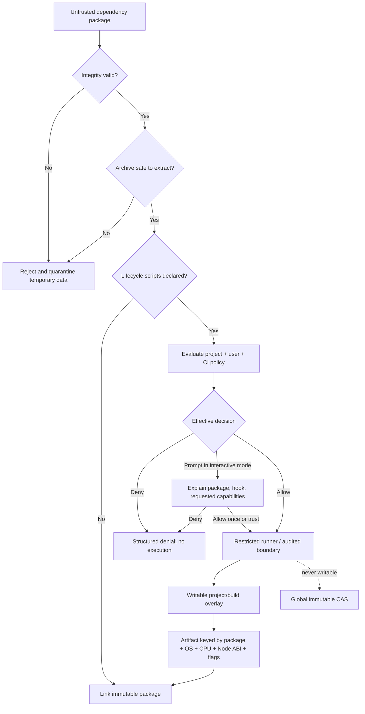
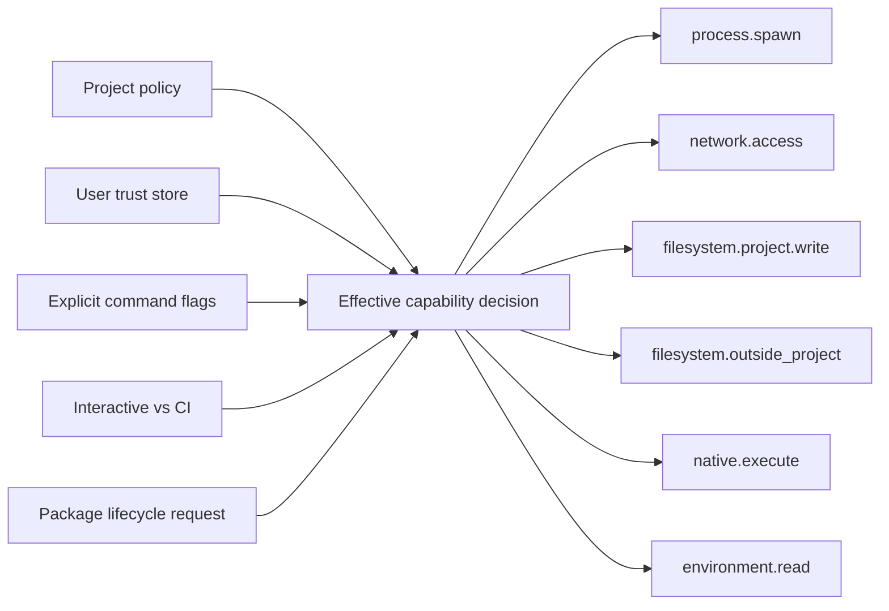

# Corex Guard security architecture

The CLI must label each capability as enforced, detected, or advisory on the
current platform; policy text must never imply a sandbox guarantee that the OS
cannot provide.

