# Transaction and concurrency architecture

## Project install transaction

```mermaid
stateDiagram-v2
    [*] --> Locked: acquire project lock
    Locked --> Resolved: validate/resolve graph
    Resolved --> Stored: ensure verified CAS objects
    Stored --> Staged: build complete temporary tree
    Staged --> Scripts: evaluate/run approved scripts
    Scripts --> Validated: validate links, bins, state
    Validated --> Activated: atomic activation
    Activated --> Committed: persist lockfile/state
    Committed --> [*]

    Locked --> RolledBack: failure/cancellation
    Resolved --> RolledBack: failure/cancellation
    Stored --> RolledBack: failure/cancellation
    Staged --> RolledBack: failure/cancellation
    Scripts --> RolledBack: failure/cancellation
    Validated --> RolledBack: failure/cancellation
    RolledBack --> PreviousInstall: remove staging; retain last good tree
    PreviousInstall --> [*]
```



## Concurrent global object commit

```mermaid
sequenceDiagram
    participant P1 as Process 1
    participant P2 as Process 2
    participant Lock as Object lock
    participant CAS as CAS object path

    par independent download/verification
        P1->>P1: prepare temp object A
    and
        P2->>P2: prepare temp object B for same content
    end
    P1->>Lock: acquire hash-scoped lock
    Lock-->>P1: granted
    P1->>CAS: validate absent; atomic rename A
    P1->>Lock: release
    P2->>Lock: acquire hash-scoped lock
    Lock-->>P2: granted
    P2->>CAS: existing object found and validated
    P2->>P2: discard its temporary object B
    P2->>Lock: release
```

Locks are scoped narrowly: one project for activation and one content key for
object commit. Downloads and verification continue concurrently outside locks.

