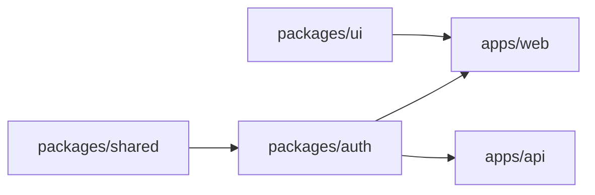
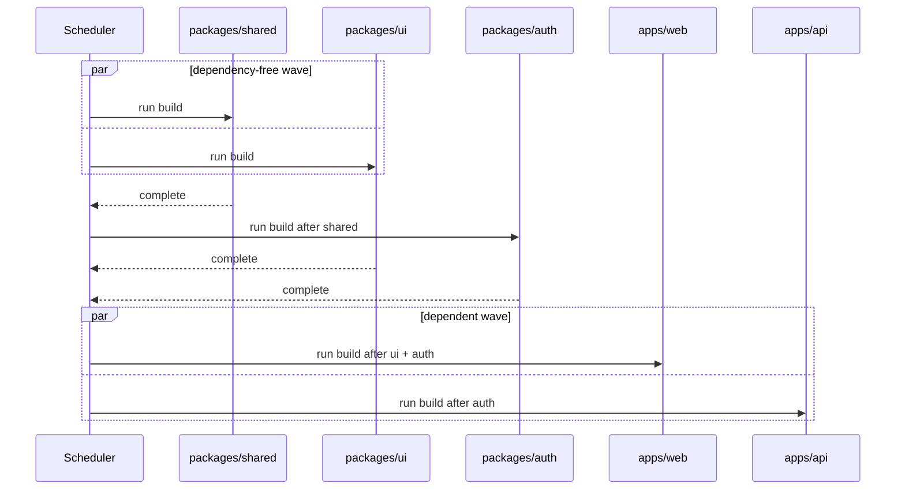
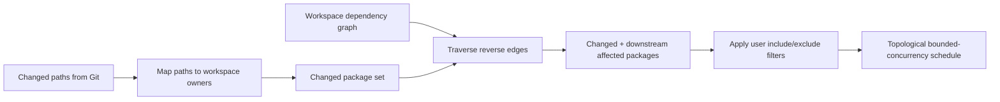

# Workspace graph and scheduler

```mermaid
flowchart LR
    Shared["packages/shared"] --> Auth["packages/auth"]
    UI["packages/ui"] --> Web["apps/web"]
    Auth --> Web
    Auth --> API["apps/api"]
```

```mermaid
sequenceDiagram
    participant Scheduler
    participant Shared as packages/shared
    participant UI as packages/ui
    participant Auth as packages/auth
    participant Web as apps/web
    participant API as apps/api

    par dependency-free wave
        Scheduler->>Shared: run build
    and
        Scheduler->>UI: run build
    end
    Shared-->>Scheduler: complete
    Scheduler->>Auth: run build after shared
    UI-->>Scheduler: complete
    Auth-->>Scheduler: complete
    par dependent wave
        Scheduler->>Web: run build after ui + auth
    and
        Scheduler->>API: run build after auth
    end
```

```mermaid
flowchart LR
    Git["Changed paths from Git"] --> Owners["Map paths to workspace owners"]
    Owners --> Changed["Changed package set"]
    Graph["Workspace dependency graph"] --> Dependents["Traverse reverse edges"]
    Changed --> Dependents
    Dependents --> Affected["Changed + downstream affected packages"]
    Affected --> Filter["Apply user include/exclude filters"]
    Filter --> Schedule["Topological bounded-concurrency schedule"]
```

Independent nodes execute together. A stable tie-breaker keeps logs and
machine-readable plans deterministic even when task completion is not.

