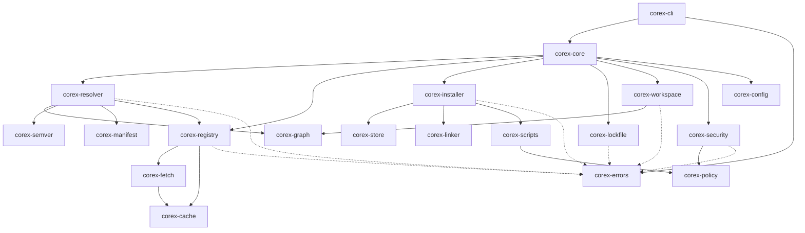

# Rust crate dependency design

Solid arrows show domain dependency direction. Dotted arrows represent shared
diagnostic types. The CLI owns presentation; domain crates do not print or
depend back on orchestration. Crates are created only when their milestone has
stable responsibilities and tests.

