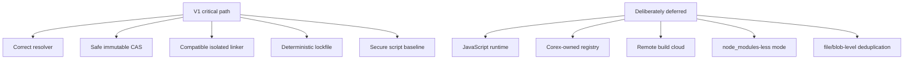

# Architecture delivery roadmap

```mermaid
flowchart LR
    P0["0.1 Foundation<br/>CLI, config, manifest, specifications"]
    P1["0.2 Resolve<br/>npm metadata, semver, graph, peers"]
    P2["0.3 Store<br/>stream, verify, CAS, offline cache"]
    P3["0.4 Install<br/>isolated linker, transactions, bins"]
    P4["0.5 Reproduce<br/>corex.lock, frozen installs"]
    P5["0.6 Guard<br/>scripts, trust, build overlays"]
    P6["0.7 Workspaces<br/>graph, recursive execution"]
    P7["0.8 Harden<br/>audit, fuzzing, provenance"]
    P8["0.9 Adopt<br/>migration, compatibility corpus"]
    P9["1.0 Stable<br/>contracts, installers, support"]
    Future["Later major<br/>Corex Virtual and sandboxed plugins"]

    P0 --> P1 --> P2 --> P3 --> P4 --> P5 --> P6 --> P7 --> P8 --> P9 --> Future
```

```mermaid
flowchart TB
    Core["V1 critical path"] --> Resolver["Correct resolver"]
    Core --> CAS["Safe immutable CAS"]
    Core --> Linker["Compatible isolated linker"]
    Core --> Lock["Deterministic lockfile"]
    Core --> Guard["Secure script baseline"]

    Deferred["Deliberately deferred"] --> Runtime["JavaScript runtime"]
    Deferred --> Registry["Corex-owned registry"]
    Deferred --> Cloud["Remote build cloud"]
    Deferred --> Virtual["node_modules-less mode"]
    Deferred --> Blob["file/blob-level deduplication"]
```

The order closes foundational correctness and security risks before expanding
the product surface.

